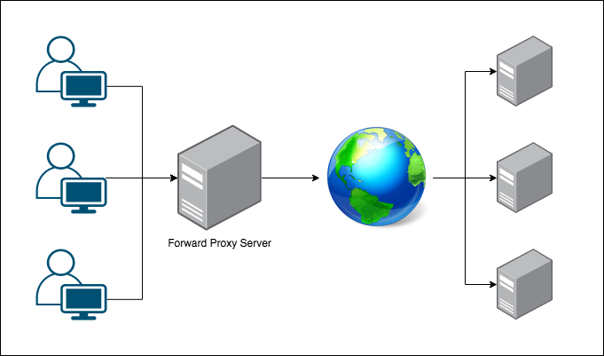
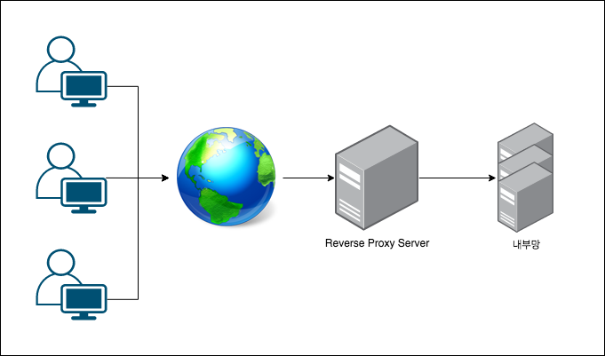

# 포워드 프록시 (Forward Proxy)와 리버스 프록시 (Reverse Proxy)
## 프록시 서버 (Proxy Server)
Proxy의 명사적 의미는 대리, 대리권이다. 일반적인 웹서버와 클라이언트의 통신은 클라이언트가 요청하고 서버가 응답해주는 방식인데, 프록시 서버가 웹서버와 클라이언트 사이에 들어가서 중계기로서의 역할을 해주는 것이다. 프록시 서버는 일반적으로 아래 두 가지의 종류가 있다.
## 포워드 프록시 (Forward Proxy)
내가 example.com이라는 도메인으로 웹서비스를 한다고 가정해보자. 프록시가 없다면 클라이언트는 인터넷을 통하여 나의 웹서버에 연결하게 된다. 하지만 포워드 프록시를 사용하게 되면 클라이언트는 포워드 프록시 서버로 요청을 하게 되고, 프록시 서버가 example.com에 연결하여 결과 값을 클라이언트로 응답하게 된다.

포워드 프록시는 자주 사용되는 컨텐츠를 캐시에 담아두고 서버로 요청하지 않고 캐시에서 응답해줄 수 있어서 성능 향상이 가능하다.

## 리버스 프록시 (Reverse Proxy)
다음은 리버스 프록시인데 위의 포워드 프록시는 클라이언트와 인터넷 사이에 프록시 서버가 있었지만, 리버스는 인터넷과 내부망 사이에 프록시 서버가 위치하게 된다. 간단한 예를 들어보면 서비스를 제공하는데 클라이언트는 굳이 서비스를 제공하는 쪽의 데이터베이스 서버 주소나 API 서버 주소를 알 필요가 없다. 요청은 example.com으로 보내고 요청에 따라 프록시 서버가 알아서 필요한 내부 서버에서 데이터를 받아와서 클라이언트로 반환하는 것이 리버스 프록시이다.

리버스 프록시는 로드 밸런싱이나 서버 확장에 유리하다.

