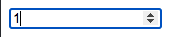

## Input box 화살표 숨기기
Input 요소를 사용할 때 타입을 지정할 수 있는데, 숫자만 입력하고 싶은 경우 아래와 같이 타입 속성의 값을 number로 작성하게 된다.

```html
<input type="number" />
```
이렇게 작성된 코드는 다음과 같이 보이는데 숫자 타입이라서 Input 박스 끝에 값을 증가, 감소 시킬 수 있는 화살표가 나타나게 된다.
<p align="center">
  
  
</p>

아래 스타일을 적용하게 되면 화살표가 안보이게 된다.
```css
/* Chrome, Safari, Edge, Opera */
input::-webkit-outer-spin-button,
input::-webkit-inner-spin-button {
  -webkit-appearance: none;
  margin: 0;
}

/* Firefox */
input[type=number] {
  -moz-appearance: textfield;
}
```
> 참고 및 출처: [https://www.w3schools.com/howto/howto\_css\_hide\_arrow\_number.asp](https://www.w3schools.com/howto/howto_css_hide_arrow_number.asp)