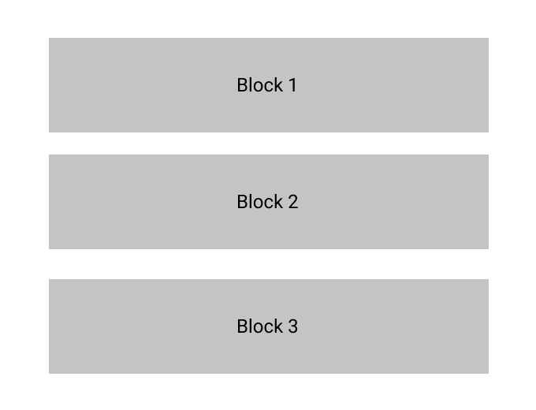
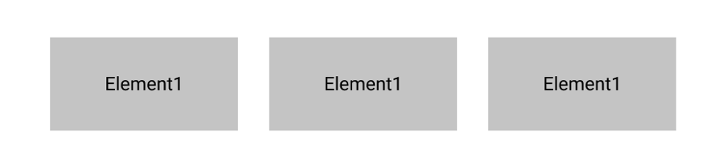

# HTML 기초

## HTML은 무엇인가?
HyperText Markup Language, 하이퍼텍스트 마크업 언어

일부 뒤에 Language만 보고 프로그래밍 언어라고 오해하는 사람들도 있는데, HTML은 프로그래밍 언어가 아니고 **마크업 언어**이다. HTML은 요소(elements)로 구성되어 있다.
> 마크업 언어(markup language)는 태그 등을 이용하여 문서나 데이터의 구조를 밝히고 표기하는 언어이다.

## HTML 요소(Element)의 구조
아래에서 맨 앞의 `<p>`태그가 요소의 시작부분이고 마지막 `</p>`태그가 요소의 끝부분이다. 그리고 그 사이 `Hello World!!`가 내용이 되며 태그의 시작부터 끝까지가 하나의 요소가 된다.
```html
<p>Hello World!!</p>
```

## 블럭 레벨 요소(Block level element)와 인라인 레벨 요소(Inline level element)
- 블록 레벨 요소는 아래 이미지처럼 앞 뒤 요소 사이에 새로운 줄을 만들고 나타낸다. 머리말, 목록, 메뉴, 꼬리말 등을 표현할 수 있다. 블록 레벨 요소는 인라인 레벨 요소 내에 포함될 수 없다.

- 인라인 레벨 요소는 항상 블록 레벨 요소 내에 포함되어 있다. 블록 레벨 요소처럼 단락을 표현하기보다 문장, 단어 등을 표현한다. 인라인 레벨 요소는 아래 이미지처럼 새로운 줄을 만들지 않는다.


## 속성 (Attributes)
요소(Element)는 속성을 가질 수 있다. 아래 코드에서 `class="memo"` 부분이 해당 요소의 속성이다. 속성을 사용하여 스타일을 적용할 수 있고, Web API를 통해 접근도 가능하다. 클래스 외에도 특정 요소들이 가지고 있는 속성도 존재한다.
```html
<p class="memo">Hello World!!!</p>
```

## HTML 문서의 구조
아래는 HTML 문서의 기본 구조이다.
```html
<!DOCTYPE html>
<html>
  <head>
    <meta charset="utf-8">
    <title>Page title</title>
  </head>
  <body>
    <p>Hello World!!</p>
  </body>
</html>
```
1. `<!DOCTYPE html>`: 문서 형식을 나타낸다.
2. `<html></html>`: HTML의 기본 요소이며, 전체 페이지의 내용을 포함한다.
3. `<head></head>`: 검색 결과에 노출 되는 키워드, 페이지 설명, CSS 스타일 등의 내용을 담고 있으며 실제 페이지에 접속하는 사용자들에게는 노출되지 않는다.
4. `<meta charset="utf-8">`: HTML 문서의 인코딩 설정을 지정한다.
5. `<title></title>`: HTML 문서의 타이틀 요소이다. 브라우저 탭바에 표시되는 부분이 이 요소에 해당한다.
6. `<body></body>`: 페이지에 접속하는 사용자들에게 노출되는 내용을 포함한다. 텍스트, 이밎, 비디오 등.